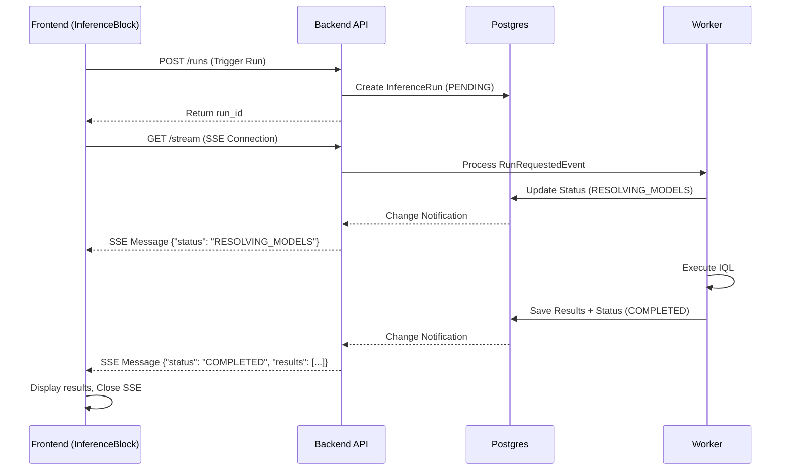

# Design Doc: Inference Execution UI & Real-time Status updates

**Date**: 2026-04-05
**Status**: Draft (Brainstorming)

## 1. Goal
Implement the frontend functionality to trigger IQL inference runs from the `InferenceBlock` and display real-time granular execution updates (using SSE) and historical results.

## 2. Background
Currently, the IQL execution pipeline exists on the backend and workers, but the frontend `InferenceBlock` is static. It needs to be connected to the `POST /runs` endpoint and handle the asynchronous nature of the worker execution by listening for status updates.

## 3. Proposed Changes

### 3.1. Backend Updates (packages/backend, packages/core, packages/db_core)
- **Domain Enhancement**: Update `InferenceRun` to include `status` (Enum: PENDING, RESOLVING_MODELS, DOWNLOADING_DATA, EXECUTING, COMPLETED, FAILED) and `execution_time_ms` (Integer).
- **ORM Update**: Sync `InferenceRunORM` with the new fields.
- **SSE Endpoint**: Add `GET /api/profiles/{profile_id}/blocks/{block_id}/runs/{run_id}/stream` in the backend.
    - This endpoint will return a `StreamingResponse`.
    - It will utilize a message bus or direct DB polling (if necessary) to stream status changes to the client.

### 3.2. Worker Updates (packages/workers)
- **Granular Progress**: Update `InferenceRunRequestedHandler` to perform intermediate updates to the `InferenceRun` status and publish progress events.

### 3.3. Frontend Updates (packages/frontend)
- **Store Enhancement**: Update `InferenceData` in `EditorStore` and `editor.types.ts`:
    ```typescript
    export type InferenceData = {
        code: string;
        status: "IDLE" | "PENDING" | "RUNNING" | "COMPLETED" | "FAILED";
        activeRunId?: string;
        results?: InferenceResult[];
        executionTimeMs?: number;
        error?: string;
    };
    ```
- **Zod Schemas & Transformations**:
    - Implement `InferenceRunRawSchema` (snake_case from API) and `InferenceRunSchema` (camelCase for internal use).
    - Provide Zod `.transform()` logic to automatically bridge between Raw API DTOs and internal frontend types.
    - Maintain consistency across all block-related schemas (e.g., `InferenceResult`).
- **New API Hooks**:
    - `useRunInferenceMutation`: Triggers the run via `POST /api/profiles/{profile_id}/blocks/{block_id}/runs`.
    - `useInferenceStream`: Custom hook using `EventSource` to listen to the SSE endpoint and update the storage.
- **UI Components**:
    - **Run Button**: Integrated into the `InferenceBlock` header/action area.
    - **ResultsPane**: Dynamically render all expressions from the `results` array.
    - **Status Indicator**: Show granular progress (e.g., "Resolving Models...", "Executing...") and a running timer.

## 4. Architecture Diagram (Event Flow)


## 5. Verification Plan
- **Backend**: Unit tests for the SSE endpoint using a mock event generator.
- **Frontend**: Manual verification in the workspace; ensure the "Run" button correctly transitions through statuses and results are rendered in order.
