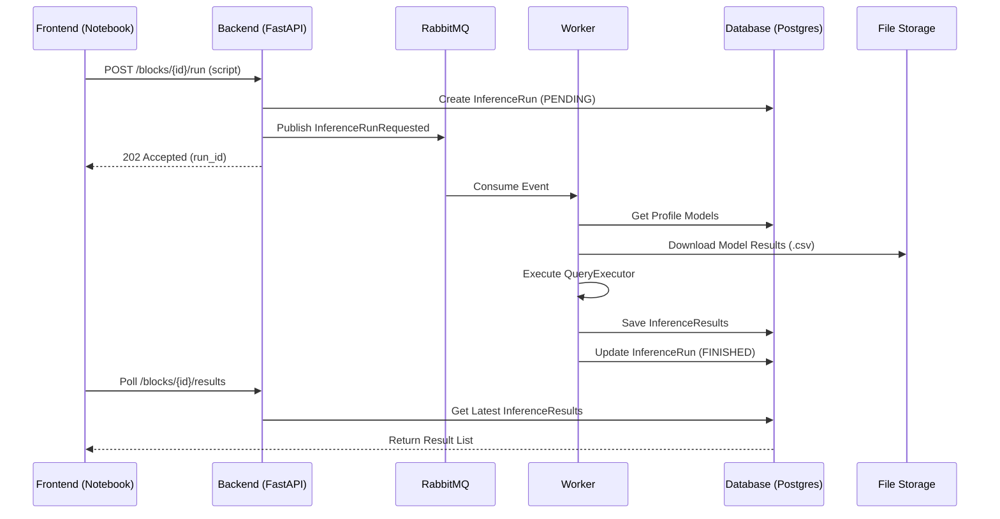

# IQL Execution Pipeline Design

## Context

The Spectrum platform provides an **Inference Query Language (IQL)** for analyzing and retrieving mathematical expressions discovered during symbolic regression. In the "Cyber Laboratory" notebook interface, users can create `InferenceBlocks` containing custom IQL scripts. 

To maintain system responsiveness and handle potentially heavy computations, IQL scripts are executed asynchronously in background workers.

## IQL Language Updates

To support querying across multiple models within a profile, the IQL grammar and executor are updated.

### Multi-Model `FROM` Clause

The `FROM` clause is expanded to support model identifiers (names or UUIDs).

*   **Syntax**: `SELECT [fields] FROM <model_identifier> [TOP N | PARETO]`
*   **Model Resolution**: 
    *   The worker retrieves all active models for the current profile.
    *   If `<model_identifier>` matches exactly one model name, that model's `Reggression` context is used.
    *   **Ambiguity Handling**: If multiple models share the same name within the profile, the worker returns a `ModelAmbiguityError`. The user must then use the unique `model_id` (e.g., `FROM "u-u-i-d"`) to disambiguate.

### Executor State
The `QueryExecutor` is initialized with a mapping of `model_id -> Reggression`. It resolves the identifier in the `FROM` clause against this map to select the execution context for the current query.

## Architecture

### Backend & Event Flow

When a user clicks "Run" on an `InferenceBlock`:
1.  **API Entry**: `POST /api/profiles/{p_id}/blocks/{b_id}/runs`
2.  **Persistence**: An `InferenceRun` record is created in the database with status `WAITING`.
3.  **Event**: An `InferenceRunRequestedEvent` is published to the `spectrum_events` exchange.

### Worker Execution

The worker listens for `inference.run_requested` and performs the following:
1.  **Model Loading**: Fetches model metadata and result CSVs from storage for the profile.
2.  **Initialization**: Instantiates a `Reggression` object for each model.
3.  **Execution**: 
    - Parses the IQL script.
    - Runs `QueryExecutor.execute()` using the mapped `Reggression` objects.
4.  **Persistence**: Saves the resulting `InferenceResultList` to the `inference_results` table.
5.  **Status Update**: Marks the `InferenceRun` as `FINISHED` or `FAILED`.

## Database Schema

### `InferenceRunORM` (Versioned)
Inherits from `ImmutableVersionedBase` to allow history of executions for a single block.

| Field | Type | Description |
|---|---|---|
| `id` | UUID | Unique ID for the run |
| `block_id` | UUID | FK to the notebook block |
| `profile_id` | UUID | FK to the profile |
| `script` | String | The IQL code that was run |
| `status` | Enum | `WAITING`, `RUNNING`, `FINISHED`, `FAILED` |
| `version` | Integer | Iterative version number |

### `InferenceResultORM` (Immutable)
Stores individual rows returned by an IQL query.

| Field | Type | Description |
|---|---|---|
| `run_id` | UUID | FK to `InferenceRunORM` |
| `expression` | String | The mathematical expression |
| `fitness` | Float | Fitness score |
| `dl` | Float | DL score |
| `latex` | String | LaTeX representation |
| `numpy` | String | NumPy code |
| `parameters` | JSONB | Constant parameters |
| `size` | Integer | AST node count |

## Data Flow

## Error Handling

- **Parse Errors**: Syntax errors in IQL are caught by the worker and saved to the `InferenceRun.error_message`.
- **Ambiguity Errors**: Handled by the worker if multiple models match a name.
- **Missing Models**: If a model referenced in `FROM` is not found, the run fails.

## Files Touched

| Layer | Files |
|---|---|
| **IQL** | `packages/inference_query_language/iql/parser/ast/from_clause.py` `packages/inference_query_language/iql/executor/query_executor.py` |
| **Domain** | `packages/core/core/features/profiles/blocks/inference/inference_run.py` `packages/core/core/features/profiles/blocks/inference/events.py` |
| **DB** | `packages/db_core/db/features/profiles/blocks/inference/runs/model.py` `packages/db_core/db/features/profiles/blocks/inference/results/model.py` |
| **Backend** | `packages/backend/app/api/v1/endpoints/inference.py` |
| **Worker** | `packages/workers/handlers/inference_requested.py` |
