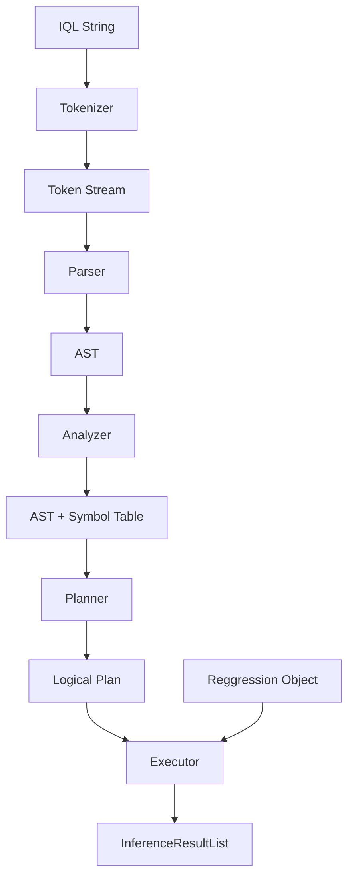

# Design: IQL Compiler Refactor

## 1. DDD Architectural Integration
The IQL package exists as a standalone domain-specific library within `packages/inference_query_language`. While it doesn't directly depend on `packages/core`, it provides the "Inference Query Language" capability used by the Application layer (Backend and Workers).

This refactor will reorganize the package into a classic compiler structure:
- **Tokenizer**: String -> Tokens (Existing)
- **Parser**: Tokens -> AST (Existing)
- **Analyzer**: AST + Context -> Semantic Metadata (New)
- **Planner**: AST + Metadata -> Logical Plan (New)
- **Executor**: Logical Plan + Reggression -> Results (Refactored)

## 2. Technical Implementation

### Domain & Structure (packages/inference_query_language/iql)

#### [NEW] Function Registry (`iql/registry/`)
A centralized registry to define builtin functions.
- `FunctionDefinition`: Name, arguments (with types), return type, and implementation.
- `FunctionRegistry`: Multi-ton or singleton to manage these definitions.

#### [NEW] Analyzer (`iql/analyzer/`)
Responsible for semantic validation.
- `SymbolTable`: Maps identifiers to their types and sources (e.g., Column, Model, Variable).
- `TypeChecker`: Ensures function arguments and expressions match expected types.
- `SemanticAnalyzer`: Visitor that traverses the AST and populates the `SymbolTable`, collecting all errors.

#### [NEW] Planner (`iql/planner/`)
Transforms the validated AST into a `LogicalPlan`.
- `LogicalPlanNode` (Base): Pydantic model for serializability.
- Concrete Nodes: 
    - `ScanNode`: Represents fetching models from a `Reggression` object.
    - `FilterNode`: Represents the `WHERE` clause.
    - `ProjectNode`: Represents the `SELECT` of specific columns.
    - `ApplyNode`: Represents function calls (like `PREDICT`).
    - `SearchNode`: Represents specialized search modes (`TOP N`, `PARETO`, `DISTRIBUTION`).

#### [MODIFY] Executor (`iql/executor/`)
Refactored to be a "Plan Interpreter".
- Instead of AST nodes, it will traverse the `LogicalPlan` tree.
- Each `LogicalPlanNode` will have a corresponding handler in the executor.
- This decoupling allows the `Planner` to optimize the plan (e.g., push filters down) without affecting the executor.

### Error Handling
A new `IqlErrorCollector` will be introduced to accumulate errors across all phases.
- If an unhandled exception occurs, it will be wrapped in a generic `IqlCompilerError` with a suggestion to create a specific exception.

## 3. Diagrams

### Execution Pipeline Flow



### Logical Plan Example (Tree Structure)

```mermaid
graph TD
    Root[ProjectNode: columns=[expression, fitness]]
    Root --> Search[SearchNode: mode=TOP, n=10]
    Search --> Filter[FilterNode: condition='size < 10']
    Filter --> Source[ScanNode: model='model_1']
```

## 4. External Dependencies
| Library | Pros | Cons | Recommendation |
| :--- | :--- | :--- | :--- |
| **Pydantic v2** | Strong validation, easy serialization for frontend. | Already a dependency. | Use for `LogicalPlan` and `FunctionDefinition`. |
| **Pandas** | Efficient DataFrame manipulation in Executor. | Already a dependency. | Continue using for intermediate results. |

## 5. Future Integration (Backend/Worker)
- **IQL Worker**: Will use the new `iql.compiler.compile(query)` to get a `LogicalPlan`, then `executor.execute(plan, regression)`.
- **Backend API**: Can expose a `GET /inference/query-plan?q=...` endpoint that returns the serialized `LogicalPlan` for the UI to render.
