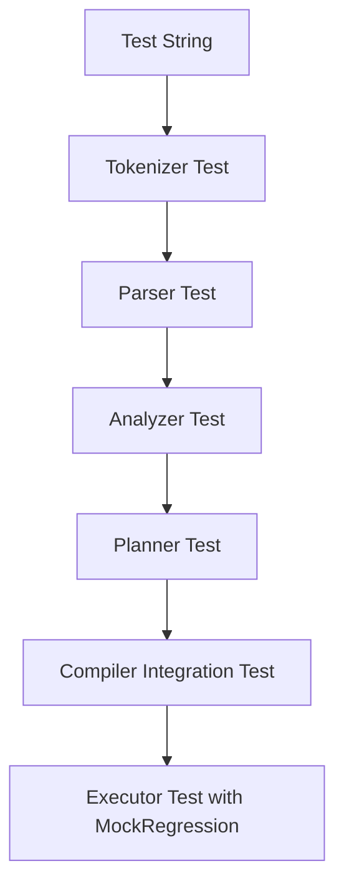

# Design: IQL Test Suite

## 1. DDD Architectural Integration
The test suite resides strictly within the `packages/inference_query_language/tests` directory. It treats the IQL package as a pure domain-logic component, independent of the database or external world.

## 2. Technical Implementation

### Directory Structure
```text
packages/inference_query_language/tests/
├── conftest.py             # Shared fixtures (MockRegression, Compiler)
├── test_compiler.py        # E2E Compiler tests (String -> LogicalPlan)
├── test_executor.py        # Interpreter tests (LogicalPlan -> Result)
├── tokenizer/
│   └── test_tokenizer.py   # Tokenization edge cases
├── parser/
│   └── test_parser.py      # AST generation & syntax errors
├── analyzer/
│   └── test_analyzer.py    # Semantic validation (Models, Functions)
├── planner/
│   └── test_planner.py     # Logical tree structure
└── fuzzing/
    └── test_iql_fuzz.py    # Hypothesis property-based tests
```

### Mock Infrastructure

#### `MockRegression`
A Python class that implements the `Reggression` protocol used by `QueryExecutor`.
```python
class MockRegression:
    def __init__(self, data: pd.DataFrame):
        self.data = data

    def top(self, n, filters, pattern):
        # Implement mockup of filtering and top-n selection
        return self.data.head(n)

    def pareto(self):
        return self.data # Simple return for mock

    def distribution(self, filters, limitedAt, atLeast, fromTop):
        return self.data
```

#### `MockPredictionService`
Mock for `PredictionEvaluationService` to return deterministic results without actual math execution.

### Fuzzing Strategy
Using `Hypothesis` to generate random strings and verifying that `IqlCompiler.compile()`:
1. Never raises a raw `Exception` (only `AbstractInferenceQueryLanguageError`).
2. Correctly identifies errors for invalid grammar.
3. Successfully parses valid constructed fragments.

## 3. Test Cases & Edge Cases

### Tokenizer
- **Edge**: Unclosed string literals like `SELECT * FROM "incomplete_model`.
- **Edge**: Identifiers with emojis or special characters.

### Parser
- **Edge**: `SELECT` without `FROM`.
- **Edge**: Nested function calls `PREDICT(PREDICT(x))`.
- **Edge**: Missing parenthesis in `PREDICT((1, 2, 3)`.

### Analyzer
- **Edge**: Model name "GhostModel" not in available models list.
- **Edge**: `WHERE id = 10` (should be valid) vs `WHERE unknown_col = 10` (should be invalid).

### Executor
- **Edge**: Empty result set from `reggression`.
- **Edge**: Function execution when `dataframe` is `None`.

## 4. External Dependencies
| Library | Pros | Cons | Recommendation |
| :--- | :--- | :--- | :--- |
| `pytest` | Standard, powerful fixtures | - | Yes |
| `hypothesis` | Finds edge cases automatically | Can be slow | Yes |
| `pandas` | Required for DataFrame processing | - | Yes |
| `pytest-asyncio` | Required if any component were async | Not needed here | No |

## 5. Diagrams

